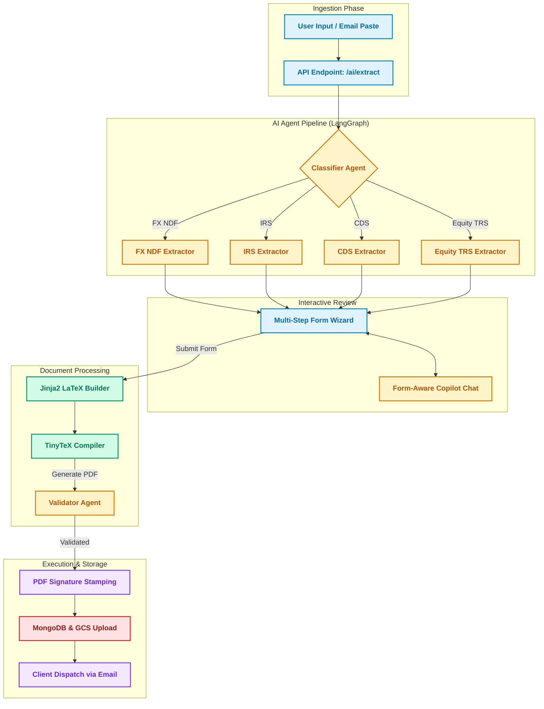
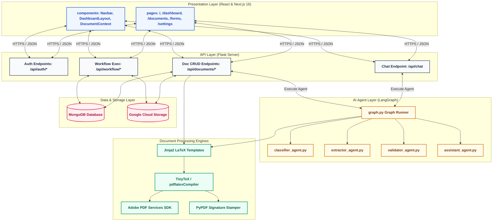

<div align="center">
  <h1>TradeDocAI</h1>
</div>

<p align="center">
  TradeDocAI is a modern, AI-powered document generation and validation platform designed to streamline institutional OTC derivative operations. It automates classification, data extraction, validation, PDF generation, and client e-signing of complex trade agreements (including <strong>FX Non-Deliverable Forwards</strong>, <strong>Interest Rate Swaps</strong>, <strong>Credit Default Swaps</strong>, and <strong>Equity Total Return Swaps</strong>).
</p>

<p align="center">
  By orchestrating specialized agents using a <strong>LangGraph</strong> pipeline with a <strong>React/Next.js</strong> frontend, <strong>Flask</strong> backend, and a precise <strong>LaTeX</strong> PDF engine, TradeDocAI transforms unstructured emails into signed, validated trade confirmations in seconds.
</p>

---

## 🎨 System Workflow

TradeDocAI streamlines trade operations from raw email inputs to final executed confirmation PDFs. The workflow is divided into five key stages:

1. **Ingestion**: The user copies a raw confirmation email or text chain (e.g., from Bloomberg or Outlook) and pastes it into the UI.
2. **AI Classification & Extraction (LangGraph)**:
   - The [classifier_agent.py](file:///c:/Users/mesou/Desktop/Trade_new/TradeDocAI/agents/classifier_agent.py) determines the contract type (FX NDF, IRS, CDS, Equity TRS).
   - The [extractor_agent.py](file:///c:/Users/mesou/Desktop/Trade_new/TradeDocAI/agents/extractor_agent.py) extracts structured trade data matching the specific document schema into structured JSON format.
3. **Interactive Review & Copilot Assistance**:
   - The UI populates a multi-step form wizard with the extracted JSON.
   - A **Form-Aware Assistant** ([assistant_agent.py](file:///c:/Users/mesou/Desktop/Trade_new/TradeDocAI/agents/assistant_agent.py)) chat panel is available to explain specific fields, recommend common options, flag invalid/nonsensical data, and highlight missing required fields.
4. **Compilation & Multimodal Verification**:
   - The verified JSON is compiled using a Jinja2 LaTeX engine to generate a pixel-perfect PDF.
   - The [validator_agent.py](file:///c:/Users/mesou/Desktop/Trade_new/TradeDocAI/agents/validator_agent.py) performs a multimodal verification comparing the original email text against the compiled PDF to flag any data mismatches or discrepancies.
5. **Client Signing & Dispatch**:
   - The document is shared with the client via a secure sharing link.
   - The client signs the document, triggering signature stamping via PyPDF and ReportLab, and saving it to MongoDB / GCS.

### Data Flow Diagram


---

## 🏛️ System Architecture

TradeDocAI implements a decoupled four-tier architecture:

### 1. Presentation Layer (Next.js)
- Responsive, premium fintech design using React 19 + Next.js 16 + Tailwind CSS v4.
- Features micro-animations powered by GSAP and Framer Motion.
- Uses Context APIs (`DocumentContext.tsx`) for global state management and persistent localStorage support.

### 2. Service & API Layer (Flask)
- RESTful web server written in [server.py](file:///c:/Users/mesou/Desktop/Trade_new/TradeDocAI/server.py) handling JWT session authentication, rate limiting, and core endpoints.
- Acts as the orchestrator for PDF compilation, file conversions, and public signing routes.

### 3. AI Orchestration Layer (LangGraph)
- A state-based agentic graph running on LangGraph ([graph.py](file:///c:/Users/mesou/Desktop/Trade_new/TradeDocAI/agents/graph.py) & [state.py](file:///c:/Users/mesou/Desktop/Trade_new/TradeDocAI/agents/state.py)).
- Integrates Google Gemini 2.5 Flash / Pro (via `google-genai`) and fallback Groq Llama models.
- Houses dedicated agents for classification, extraction, validation, and conversational assistance.

### 4. Compilation & Storage Engines
- **LaTeX Engine**: Dynamic Jinja2 templating compiles documents via TinyTeX (Docker) or MiKTeX (Windows local).
- **Adobe PDF Services**: Handles high-performance document conversions (PDF to Word).
- **Stamping Engine**: Integrates PyPDF and ReportLab for placing secure, dynamic visual signatures.
- **Persistence**: MongoDB for transactional metadata and Google Cloud Storage (GCS) for secure PDF binaries.

### Architecture Diagram


---

## 🖥️ User Interface & Navigation

The Next.js UI is organized into structured views designed for high-efficiency trade management:

1. **Landing Page (`/`)**: A sleek introduction with interactive features, showcasing capabilities, and providing direct portals for login or demo signup.
2. **Dashboard (`/dashboard`)**: The operational hub.
   - Highlights key performance indicators: Total Contracts, Pending Signatures, Processing, and Storage utilized.
   - Embeds an upload/paste modal to kick off new extractions.
   - Lists recent drafts and active workflows.
3. **Documents Registry (`/documents`)**:
   - Comprehensive table grid supporting full-text search, trade-type sorting, status filters, and pagination.
   - Allows users to delete, copy sharing links, or jump back into drafts.
4. **Interactive Document Viewer (`/documents/[id]`)**:
   - **Preview Tab**: Real-time PDF preview pane.
   - **Extracted Data Tab**: An interactive form showcasing values extracted by the AI, complete with color-coded confidence indicators and discrepancy warnings.
   - **Export Tab**: Supports downloading the validated contract as a PDF or converting it instantly to a MS Word (`.docx`) file.
5. **Form Wizard (`/forms`)**:
   - A step-by-step assistant for manual creation.
   - **Step 1 (Select Schema)**: Choose templates (FX NDF, IRS, CDS, Equity TRS).
   - **Step 2 (Fill Fields)**: Dynamic forms powered by JSON schemas.
   - **Step 3 (Review)**: Final audit before generation.
   - **Step 4 (Success)**: Finalized document confirmation.
6. **Settings Page (`/settings`)**:
   - User profile configuration and credentials.
   - Toggle switches for active notification channels and API integration keys (GCP, Groq, Adobe).
   - Storage utilization metrics.

---

## 🛠️ Tools & Technologies Used

| Category | Technology | Description |
| :--- | :--- | :--- |
| **Frontend Core** | Next.js 16 (App Router), React 19, TypeScript | Robust framework for server-rendered UI components. See [ui-app/package.json](file:///c:/Users/mesou/Desktop/Trade_new/TradeDocAI/ui-app/package.json). |
| **Frontend Styling**| Tailwind CSS v4, Vanilla CSS variables | Curated dark-themed palette, fluid responsive grids. |
| **UI Motion** | GSAP, Framer Motion, Cobe | Smooth animations and micro-interactions with dynamic 3D globe. |
| **Backend Core** | Flask, Flask-CORS, Flask-Limiter | Python web server orchestrating file operations and database links. See [server.py](file:///c:/Users/mesou/Desktop/Trade_new/TradeDocAI/server.py). |
| **Agent Pipeline** | LangGraph, LangChain | State-based graph runner managing agent coordination and fallbacks. See [graph.py](file:///c:/Users/mesou/Desktop/Trade_new/TradeDocAI/agents/graph.py). |
| **AI Foundations** | Google Gemini 2.5 (Flash/Pro), Groq | Multi-modal validation, structured JSON data extraction, and copilot. |
| **Document Compile** | Jinja2 Templates, TinyTeX (pdflatex) | Generates high-fidelity LaTeX compiles for clean financial templates. |
| **PDF Stamping** | PyPDF, ReportLab | Programmatically stamps digital signatures and metadata on PDFs. |
| **File Conversion** | Adobe PDF Services SDK | Enterprise API converts compiled PDFs directly into editable Word docs. |
| **Database** | MongoDB (PyMongo) | Stores trade records, validation logs, users, and audit steps. |
| **Object Storage** | Google Cloud Storage (GCS) | Cloud object store saving and issuing signed URLs for PDF documents. |
| **Infrastructure** | Docker, Docker-Compose | Containerized environment bundling Web server, TeX dependencies, and DB. See [Dockerfile](file:///c:/Users/mesou/Desktop/Trade_new/TradeDocAI/Dockerfile) and [docker-compose.yml](file:///c:/Users/mesou/Desktop/Trade_new/TradeDocAI/docker-compose.yml). |

---

## 🚀 Deployment Guide

### Prerequisites
1. **Docker & Docker-Compose** installed on the deployment host.
2. A **Google Gemini API Key** (obtainable from Google AI Studio).
3. (Optional) **Adobe PDF Services Credentials** (if using high-performance PDF-to-Word conversions).

### Docker Deployment
The quickest and most consistent way to deploy TradeDocAI is using Docker.

1. **Clone the Repository & Set Environment Variables**:
   ```bash
   git clone https://github.com/sanjay-r123/TradeDocAI.git
   cd TradeDocAI
   cp .env.example .env
   ```
   *Edit the `.env` file to replace placeholder values with your credentials (specifically `GEMINI_API_KEY`, `AUTH_SECRET`, etc.).*

2. **Launch Services**:
   ```bash
   docker-compose up -d --build
   ```
   This command starts:
   - **MongoDB** container running on port `27017` with persistent volumes.
   - **TradeDocAI App** container running on port `5055` (built via [Dockerfile](file:///c:/Users/mesou/Desktop/Trade_new/TradeDocAI/Dockerfile), which installs Python 3.11, Next.js statically exported files, and TinyTeX).

3. **Verify Health**:
   The app container contains a built-in health check polling `/health/live`. Verify with:
   ```bash
   docker ps
   ```

4. **Access the System**:
   Navigate to `http://localhost:5055` in your browser.
   - *Default credentials (if `ENABLE_DEMO_USER=true` is set)*: `demo@tradedoc.ai` / `demo123`

---

## 💻 Local Development Setup

If you prefer to run the application locally without Docker containers, follow these instructions:

### 1. Python Environment Setup
1. Ensure **Python 3.9+** is installed.
2. Install LaTeX command line compiler. On Windows, install **MiKTeX** (ensure "Install missing packages on-the-fly" is set to "Yes"). On macOS/Linux, install **MacTeX** or **TeX Live**.
3. Locate the `pdflatex` executable on your system (e.g., run `where pdflatex` on Windows or `which pdflatex` on unix) and update the `PDFLATEX` variable path in the generator scripts:
   - [generate_fx_ndf.py](file:///c:/Users/mesou/Desktop/Trade_new/TradeDocAI/templates/FX_Trade_Confirmation/generate_fx_ndf.py)
   - [generate_irs.py](file:///c:/Users/mesou/Desktop/Trade_new/TradeDocAI/templates/IRS_Confirmation/generate_irs.py)
4. Create and activate a python virtual environment, and install dependencies listed in [requirements.txt](file:///c:/Users/mesou/Desktop/Trade_new/TradeDocAI/requirements.txt):
   ```bash
   python -m venv venv
   # On Windows:
   venv\Scripts\activate
   # On macOS/Linux:
   source venv/bin/activate

   pip install -r requirements.txt
   ```

### 2. Frontend Development Setup
1. Navigate to the frontend directory:
   ```bash
   cd ui-app
   npm install
   ```
2. Start the Next.js development server:
   ```bash
   npm run dev
   ```
   The UI will run on `http://localhost:3000`.

### 3. Backend Development Setup
1. In a separate terminal shell, activate the python virtual environment in the project root directory.
2. Start the backend Flask server:
   ```bash
   python server.py
   ```
   The API will run on `http://localhost:5000` (which is targetable by the Next.js local server).

---

## 📂 Codebase Reference
To explore or modify the system, here are the entry files for each subsystem:
- **Backend Entry Server**: [server.py](file:///c:/Users/mesou/Desktop/Trade_new/TradeDocAI/server.py)
- **Agent Orchestrator Graph**: [agents/graph.py](file:///c:/Users/mesou/Desktop/Trade_new/TradeDocAI/agents/graph.py)
- **Agent Global State**: [agents/state.py](file:///c:/Users/mesou/Desktop/Trade_new/TradeDocAI/agents/state.py)
- **Email Classifier**: [agents/classifier_agent.py](file:///c:/Users/mesou/Desktop/Trade_new/TradeDocAI/agents/classifier_agent.py)
- **Structured LLM Extractor**: [agents/extractor_agent.py](file:///c:/Users/mesou/Desktop/Trade_new/TradeDocAI/agents/extractor_agent.py)
- **Multimodal Validator**: [agents/validator_agent.py](file:///c:/Users/mesou/Desktop/Trade_new/TradeDocAI/agents/validator_agent.py)
- **Form Copilot**: [agents/assistant_agent.py](file:///c:/Users/mesou/Desktop/Trade_new/TradeDocAI/agents/assistant_agent.py)
- **Frontend Entry page**: [ui-app/app/page.tsx](file:///c:/Users/mesou/Desktop/Trade_new/TradeDocAI/ui-app/app/page.tsx)
- **Docker Blueprint**: [Dockerfile](file:///c:/Users/mesou/Desktop/Trade_new/TradeDocAI/Dockerfile) / [docker-compose.yml](file:///c:/Users/mesou/Desktop/Trade_new/TradeDocAI/docker-compose.yml)
